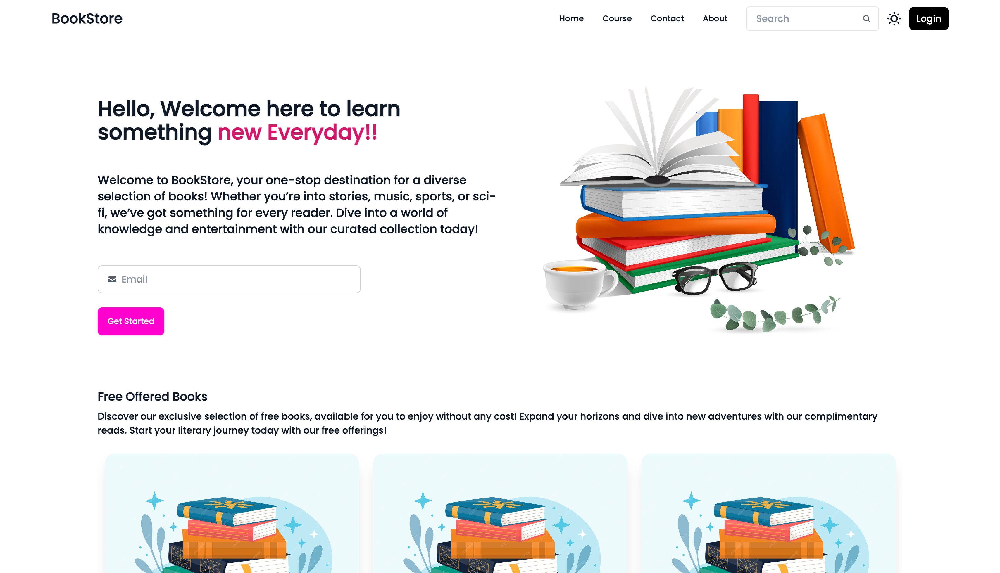
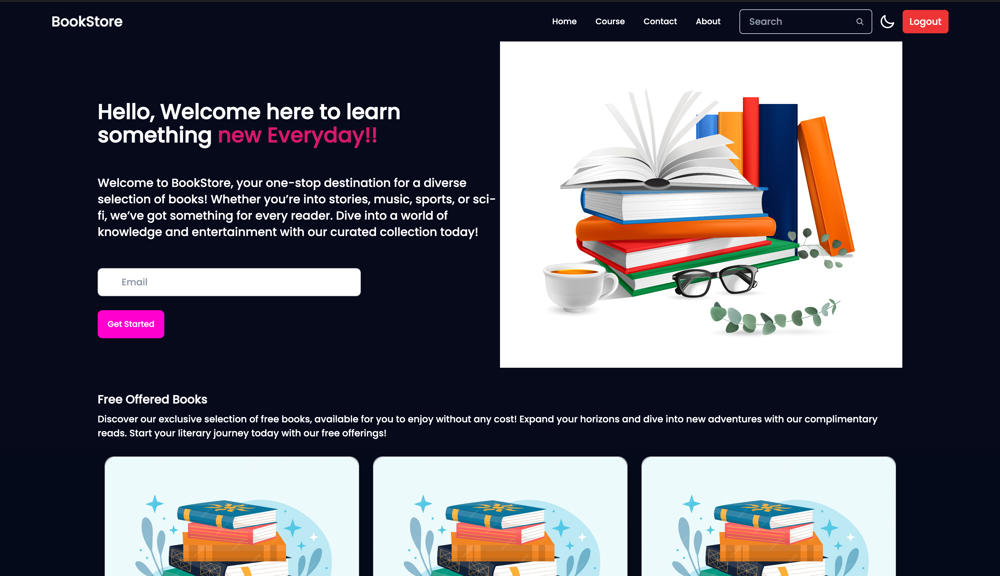
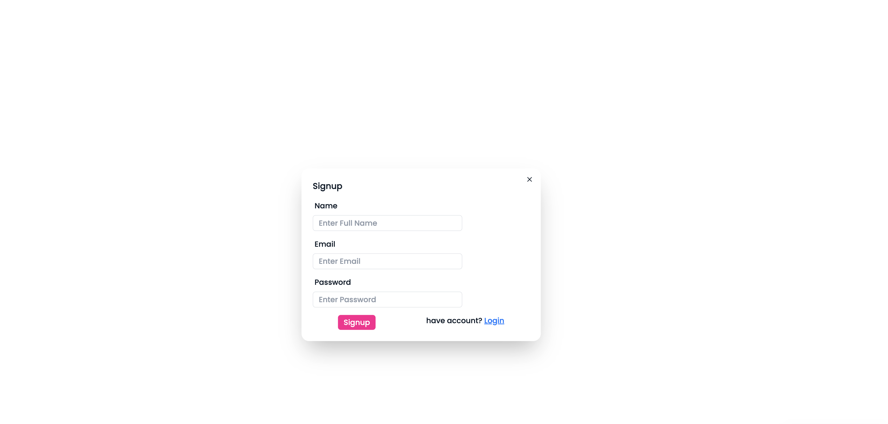
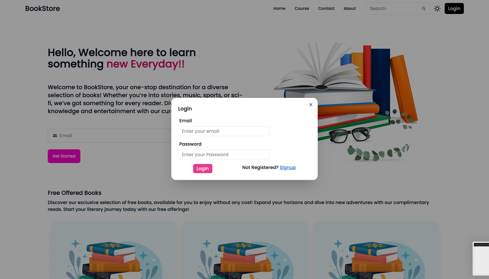
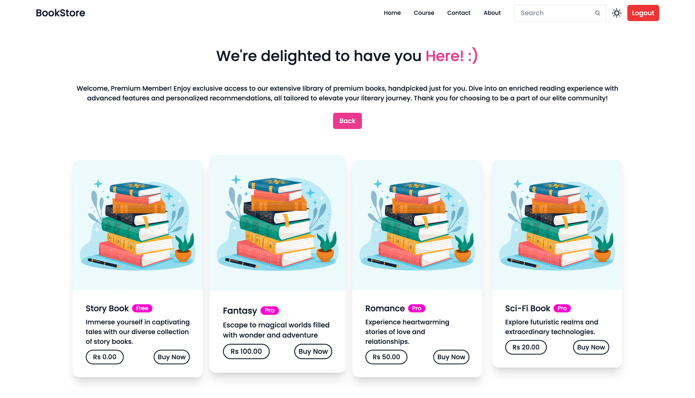
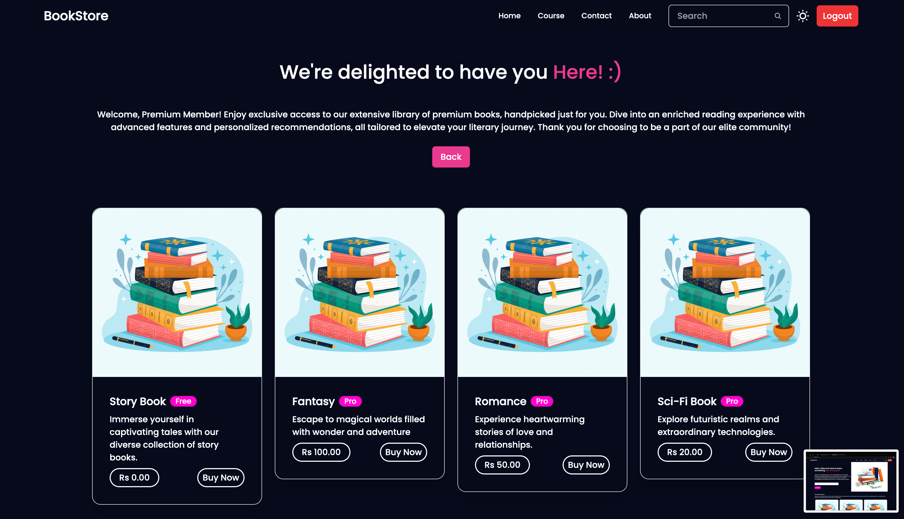
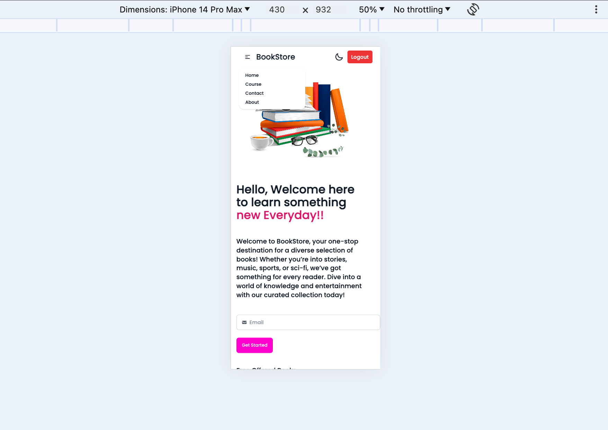

# BookStore App

Welcome to the BookStore App! This project is a full-stack application developed using the MERN stack (MongoDB, Express.js, React, and Node.js). It offers a variety of books categorized into free and premium sections. Users can sign up to access premium books, while free books are accessible without login. The app supports both dark and light modes and is fully responsive.

## Table of Contents
- [Demo](#demo)
- [Features](#features)
- [Technologies Used](#technologies-used)
- [Installation](#installation)
- [Usage](#usage)
- [Screenshots](#screenshots)

## Demo
Check out the live demo of the website [here](https://your-demo-link.com).

## Features
- New users must sign up to view the premium books category
- Free books category is accessible without signup/login
- Signup and login features are protected with MongoDB Atlas authentication
- Secure authentication for every user session
- Logout feature
- Responsive design for various devices (mobile, tablet, desktop)
- Supports both dark and light modes

## Technologies Used
- **Frontend**: HTML, CSS, JavaScript, React
- **Backend**: Node.js, Express.js
- **Database**: MongoDB Atlas
- **Authentication**: JSON Web Tokens (JWT), bcrypt

## Installation
To run this project locally, follow these steps:

1. Clone the repository
    ```sh
    git clone https://github.com/your-username/bookstore-app.git
    ```
2. Navigate to the project directory
    ```sh
    cd bookstore-app
    ```
3. Install dependencies for both the backend and frontend
    ```sh
    cd backend
    npm install
    cd ../frontend
    npm install
    ```
4. Create a `.env` file in the `backend` directory and add the following environment variables:
    ```env
    MONGO_URI=your-mongodb-atlas-uri
    JWT_SECRET=your-jwt-secret
    ```
5. Start the development servers
    ```sh
    cd backend
    npm start
    cd ../frontend
    npm start
    ```

## Usage
1. Visit the homepage.
2. View the free books category without logging in.
3. Sign up or log in to access the premium books category.
4. Use the logout feature to end your session.
5. Toggle between dark and light modes using the switch at the top-right corner.
6. Experience the responsive design on various devices (mobile, tablet, desktop).

## Screenshots
### Homepage-light


### Homepage-dark


### Signup


### Login


### Course Page-Light


### Course Page-Dark


### Mobile View

